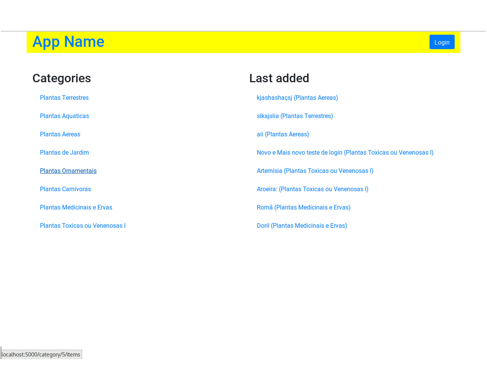

# Item Catalog

Modern web applications perform a variety of functions and provide features and utilities to their usersbcreating, reading, updating and deleting data. In this project, combine knowledge about front-end development to make a good resposive page and back-end development to create a persistent data storage and user authentication&authorization to create a web application that provides a compelling service to your users.

This application provides a list of items within a variety of categories as well as provide a user registration and authentication system.
Registered users will have the ability to create, edit and delete their own items and admin users can be create, edit and delete items em categories

## Getting Started
This project use a Python3 web server. You can run this in a virtual machine. If you need help to install and setup a virtual machine with VirtualBox and Vagrant, check the reference link bellow on Resources.

### Prerequisites
* [Python3](https://www.python.org/ "Python Homepage")
* [Python3 Modules](requirements.txt "Requisites for python3")
* [Web Server](https://en.wikipedia.org/wiki/Web_server/ "Wikipedia article about Web Servers")

### Installing and Running
1. Clone this git repositoriy:
    ```
      $ git clone https://github.com/psaviott/Item-Catalog.git
    ```

2. Install the required modules:
    ```python3
      $ pip3 install -r /path/to/requirements.txt
    ```

3. If you whant to populate the database run:
    ```python3
      $ python3 setup_database.py
    ```

4. Run the application:
    ```python3
      $ python3 application.py
    ```

## Running the tests

Access the main page of the application use the link http://localhost:5000/.



Format: Print of the public homepage</img

## Built With

* [Python3](https://docs.python.org/ "Python3 documentation") Programming Language
* [Flask](http://flask.pocoo.org/ "Flask homepage") Python Framework
* [SQLAlchemy](https://www.sqlalchemy.org/ "SQLAlchemy homepage") Python SQL toolkit and Object Relational Mapper
* [OAuth2.0](https://oauth.net/2/ "OAuth2.0 homepage") industry-standard protocol for authorization

## Authors

* Philipe Saviott - [psaviott](https://github.com/psaviott)

## Acknowledgments
* [Google Sign-In](https://developers.google.com/identity/sign-in/web/sign-in "PostgreSQL documentation") Integrating Google Sign-In into your web app
* [Python3](https://docs.python.org/3.6/index.html "Python3 documentation") documentation
* [VirtualBox and Vagrant](https://www.taniarascia.com/what-are-vagrant-and-virtualbox-and-how-do-i-use-them/ "How to use Vagrant and VirtualBox") by Tania Rascia
